# T-erroR #
---

## Contents ##
---

* UX
    * [Project Goals](#project-goals)
    * [User Goals](#user-goals)
    * [User Stories](#user-stories)
    * [User Requirements and Expectations](#requirements)
    * [Design Choices](#design-choices)
        * [Fonts](#fonts)
        * [Icons](#icons)
        * [Colors](#colors)
* [Wireframing](#wireframing)
* [Features](#features)
    * [Features that have been developed](#developed)
    * [Features that will be implemented in the future](#implemented)
* [Technologies](#technologies)
* [Testing](#testing)
* [Issues](#issues)
* [Deployment](#deployment)
* [Credit](#credits)

## UX (User Experience) ##
---

### Project Goals ###

The **goal** for this project is to create an **horror-oriented timed quizz** called **T-erroR** that question the user about their knowledge of horror movies and gives a survival score at the end.

### User Goals ###

* **Testing his/her/their knowledge** on **Horror movies** within **15sec** per question.
* **Being entertained** by the game.
* **Playing** all the **cards**.
* **Score high** on all cards.
* Get a **final score for survival**.
* **Play** the game **again**.

### User Stories ### 

* The **user** wants an **attractive game** witha **non-distracting** background.
* The **user** wants a **personalized** experience and create a **username**
* The **user** wants **clear instructions**
* The **user** wants to be **challenged** in his/her/their **knowledge** of **horror movies**.
* The **user** wants to have **diversity** in question difficulty.
* The **user** wants to **know** when a **level is completed**.
* The **user** wants to **know** when  **the game is over**.
* The **user** wants to get a maximum of points.
* The **user** wants to **survive** the game.
* The **user** wants his **username** to be **saved** and **start** the game where it was left.
* The **user** wants to **have the possibility** to **play again**.

### Research ###

* When developing this **game**, I kept in mind that the aesthetic should be inspired by Horror Movies. I tried to create a moody and slightly unnerving ambiance for the landing page and a cleaner, colder approach for the card page.
* I checked **previously made horror quizz**, used **my own horror movie knowledge** and watched **new horror movies** for **trivia**.
* I found a [**Youtube quizz tutorial**](https://www.youtube.com/watch?v=pQr4O1OITJo) that I first **coded along** in this [**repository**](https://github.com/AudreyLL88/quizz) and adapted to my needs.

### Design Choices ###
---

### Fonts ###

* The **landing page** is using the  horror classic **Google Fonts** **Denk One** for the H1 and H3. That font is associated with a [**Neon effect**](https://codepen.io/AllThingsSmitty/pen/VzXrgY) and a [**slow Pulse effect**](https://tilomitra.github.io/infinite/) on the H1.
I chose the pulsing effect because of its association with a heartbeat, which is a sound often associated with horror and fear. I paired it with the **Google Fonts** **Montserrat** for readability.
* The **card page** is using **Denk One** again for the **H3 page title** paired with **Montserrat** on the **instructions** in the **header** as well as on the **cards**.
* I kept the **Montserrat** font for **better user experience** in the **quizz** and **avoid confusion**.

### Icons and Images ###

* **All icons** used on the website are provided by [**FontAwesome**](https://fontawesome.com/) on the **card result** and **final result boxes**.
* The **image** used for the **landing page** is a **free image** from the image bank [**Pixabay**](https://pixabay.com/sv/) with a simple research with the keyword **spooky**.
* **All cards images** have been custom made by **Ivar Dahlberg** (aka my husband) for this **game**.

### Colors ###

* The **color scheme** used for the website is a classic **slasher poster palette** composed of a combination of **dark and light reds** for the **title** as well the **buttons** on the **cards** and the **quizz** paired with an **off-black** and **pure white**.
* The **gradients** used for the **body** and the **Quizz background** can both be found on [**Ui Gradients**](https://uigradients.com/) under the names **Frozen** and **Anwar**.

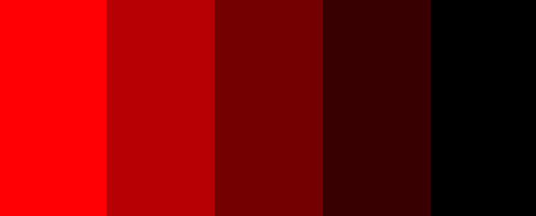 
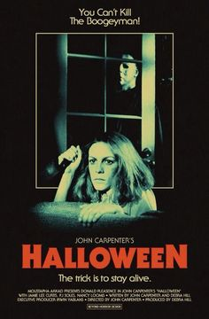

## Wireframing ##
---
For **wireframing** I used the tool [**Balsamiq**](https://balsamiq.com/).

View my wireframes [here](img/readme/t-error.pdf).

* As you can see this is **a minimal wireframe** and I pushed a few changes for better readability and engagement:
* I added the **username** box after my **mentor** suggested **local browser storage**.
* I added **a full-screen hero image** on the landing page.
* I added a **full-screen background** behind the quizz box rather than letting the cards visible in the background.

## Features ## 
---

### Implemented Features ###

* **Responsiveness** on all screen sizes.
* **Pulsing neon title** for attractiveness and engagement.
* **Cards flipped on hover** as an introduction to the theme and choice management for the user. One card cannot be played multiple times.
* **Instruction box** displayed on click on the same page as the card game .
* **Multiple choice on click quizz box with timer** taking information from an array depending on which card is played .
* **Card Score** at the end of each card played.
* **Final Score** based on each card score when all cards are played with pictures
* **Local Data storage** in browser so the username can recover his score.

### Future implemented features ###

* Image hint.
* Ratings on the game.

## Technologies used ##

* [HTML](https://developer.mozilla.org/en-US/docs/Web/HTML)
* [CSS](https://developer.mozilla.org/en-US/docs/Web/CSS)
* [Javascript]()
* [JQuery](https://jquery.com/)

**Tools & Libraries**

* [Bootstrap](https://getbootstrap.com/)
* [Font-Awesome](https://fontawesome.com/icons?d=gallery)
* [Google fonts](https://fonts.google.com/)
* [Git](https://git-scm.com/)

## Testing ##
---
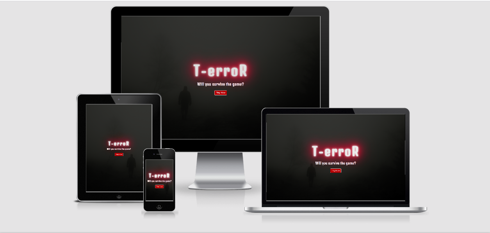

* I tested the responsiveness of the website by using the [**Google Chrome DeveloperTool**](https://developers.google.com/web/tools/chrome-devtools) as well as the plug-in **Unicorn Revealer** to control my overflow and the website [**Am I Responsive**](http://ami.responsivedesign.is/). 
* I also tested my website on **different browsers and real devices** : **Iphone 6s, Iphone X, Ipad Pro 12", Macbook air and Samsung Galaxy S20.**
* I used a first **dirty version** of this project on **Gitpod** and **refactored** my code **step by step** to remove any **useless classes**
* I tested my CSS file and my HTML files using [**CSS Validator**](https://jigsaw.w3.org/css-validator/) and [**HTML Validator**](https://validator.w3.org/).
* I tested every **functions** of my script.js using multiple **console.log** and checking for **errors** in the **Google Chrome console**.
* I tested my Javascript files with [**JSHint**](https://jshint.com/).
* All pages passed the HTML,CSS and JS validator final test with no major issues.

**Responsiveness**

* **Implementation** 

* I used **Bootstrap** (on the landing page only) as well as **flexbox and custom CSS media queries** to ensure that the website didn't break on all screen sizes.
* To ensure that the **hover** class would work on IOS, I used the poetic attribute **ontouchmove** in the html tag of card.html.

**Hover Cards**

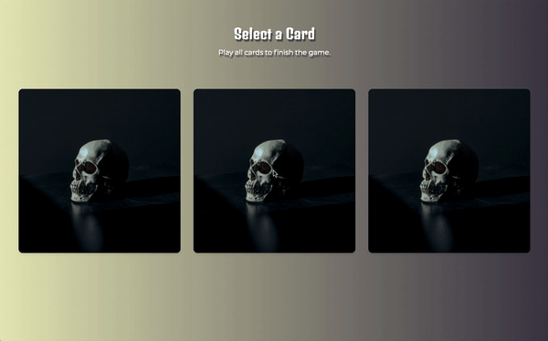

* **Implementation** 

* I decided to section the quizz in **three different horror subgenre: Slasher, Monster and Paranormal**. Each card has a separate design and leads to a different quizz. 
* I liked the **hover** property better than the **on click** for these cards because I want to let the **user decide** on which card the game will start and end.
* I used [**this tutorial**](https://1stwebdesigner.com/learn-how-to-create-flip-cards-using-css/) by **Shruti Balasa** to create the cards because they were the closest to what I wanted them to look like.
* The cards are made only with **HTML5 and CSS3** using **Flexbox** and are **responsive** on all screen sizes.

**Neon Pulsing Title**

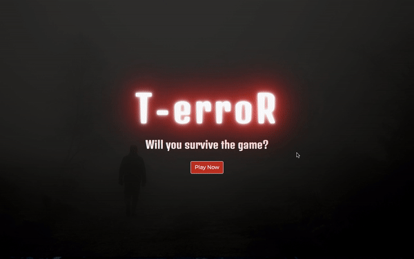

* **Implementation** 

* As stated above, I wanted to create an **unsettling ambiance** for the landing page. A **Red pulsing neon** title is a reminder of a **distress signal** in the darkness or even a **creepy motel** sign à la **Psycho** by **Alfred Hitchcock**.
* I used [**this example on CodePen**](https://codepen.io/AllThingsSmitty/pen/VzXrgY) by **Matt Smith** for the **Neon** effect and changed the **colors**.
* I used [**This CSS3 library**]() for the **pulse effect** and slowed it down a liitle.

**Quizz with timer**

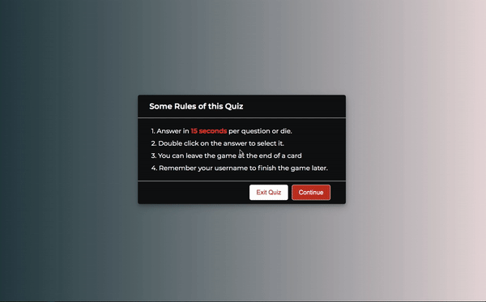

* **Implementation**

* For the **Quizz**, I coded along [**This tutorial**](https://www.youtube.com/watch?v=pQr4O1OITJo) by **CodingNepal** in a **first repository**. Then I added **my own variables** and **design choices** to adapt it to **T-erroR**.
* The **Quizz** is entirely made with **Javascript**.
* I decided to **remove** the **timeline** which I found **uncessesary**. 
* There are **3 different quizzes** with **5 preset questions** each.
* The **timer** is set to **15sec** and resets at each questions.
* The **questions and options** of **each quizz** are **stored** in **a multi-dimentional array** then passed in **the linked html file** through a **function**.
* The **quizz** allows the user to select **one option** and immediately shows to the **user** if he/she/they **selected** the **right or wrong** answer with a **color code**.
* The **Next button** displays **only after** an option has been **selected**.
* When the **timer is over**, the **quizz** **automatically** shows the **correct answer** and displays the **next button**.

**Card Score**

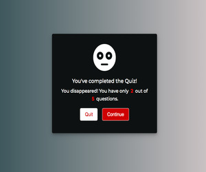 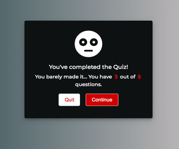 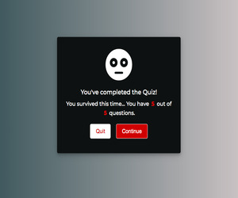

* **Implementation**

* Each **card** is linked to a **card counter** variable passed in a **function** which allows to **separate the scores per cards** and **disable the cards that are already played**.
* The **Card Score** is entirely made with **Javascript**.
* At the **end** of each **quizz** a **result box** appears, stating the **card score** and giving a **customized message** stating the **user's status in the game** depending on the **card score**.
* There are **3 different status** depending on the **score**: **Survivor**, **Barely Made it** and **Missing** .

**Final Score**

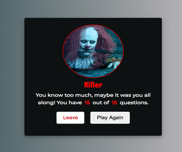 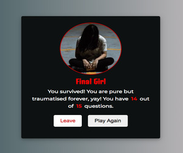 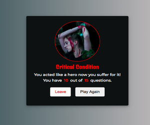 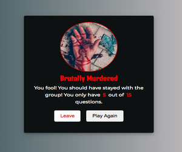 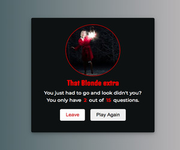

* **Implementation**

* Once **all 3 cards** are played, **regardless of the order**, **the final box appears** and marks the **end of the game**
* The **Final Score** is entirely made with **Javascript**.
* The **Final score** is based on the **total score** variable which is stored in the **function** that **allows options to be selected** during the quizz and set **right and wrong answers** .
* The **final score** box gives a **custom status** from an array informing the user if the survived the game or not. The status include an **image**, a **title**, a **message** and the **score**.
* There are **5 different status**: **Killer** if the score equals 15, **Final Girl** if the score is above 13, **Critical Condition** if the score is between 8 and 13, **Brutally Murdered** if the score is between 8 and 3 and **That Blonde extra** for score between 0 and 3.

**Local Browser Storage**

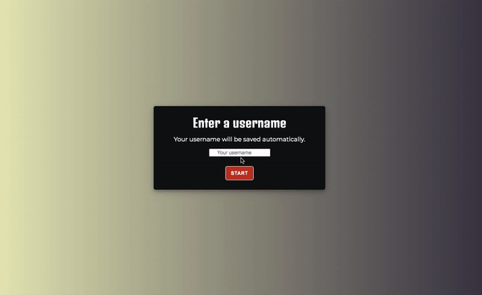
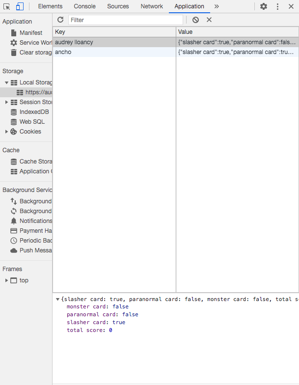

* **Implementation**

* This **feature** was made using the [**localStorage**](https://www.w3schools.com/jsref/prop_win_localstorage.asp) property in **Javascript**
* The **user** enter a **username before the game starts** saved in a **variable** and passed in a **function** which will be **stored in the browser automatically**.
* The **username** is **not case insensitive**.
* **Each time** a **card** is played a **function** automatically **saves the game**.
* If the **user** decides to **quit the game** while there are still **cards to play**, he/she/they can re-enter their **username** and the **game will be back where it was left**.
* When the **game is over**, the **previous data** is **deleted** so the **user** can play **again** starting from the beginning.

## Issues ##
---

**During development**

* I had a major issue with my script.js file after everything was done because of this issue:
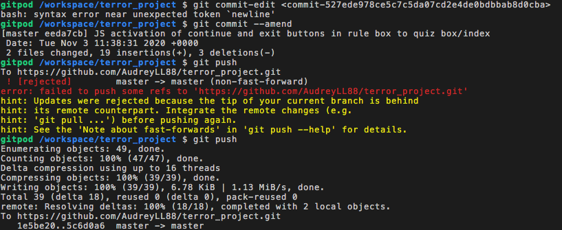

I did not understand what was going on but it stopped my javascript from working and couldn't get help so I created a second script file and copy/pasted step by step code from the first "dirty" repository I worked on. I then deleted the damaged script file, but it also deleted all my commits on that file...
You can find the code from **the first "dirty" repository here : https://github.com/AudreyLL88/terror_v1.git**

* After I put my **project** up for **peer-review**, it was brought to my attention that the **placeholder text** in the **username input** was not centered on **mobile**. I fixed it by **removing** the **short-hand padding** and simply adding **a padding-left** to the placeholder.
* After my **mentor call** and my **peer-code-review** I realized that the code for the **card buttons** and the **final box result** was a bit **wet** so I fixed it using **arrays** and **forEach** properties.

## Deployment ##
---
**T-erroR** was developed on **GitPod**, using **GitHub** to host the repository and deployed on **GitHub Pages**.
**GitHub** made the deployment extremely painless:

* Connected to Github
* Selected the repository **AudreyLL88/terror_project**
* Clicked on **"settings"** in the navigation bar
* In the **GitHub Pages** I selected **Master Branch** and **/root** in the dropdown menu and clicked **Save**
* I waited 2 minutes.
* And voila! **The website is now live on https://audreyll88.github.io/terror_project/**.

**Cloning ?** No problem:

* In my repository **AudreyLL88/terror_project**, click on the **"Code** green button, **copy in clipboard the HTTPS link**, open your **IDE** and look through my files.
* The link : **https://github.com/AudreyLL88/terror_project.git**

## Credits ##
---

**Text Credits:**

* All text content has been written by yours truly, Audrey Laurène Lloancy.

** Image Credits:**

* The **three cards digital illustrations** were made by the amazing Ivar Dahlberg.

**Many thanks to:**

* My mentor **Ignatius Ukwuoma** for his patience and kindness
* **Byllsa** for her very inspiring ReadME
* **Code Institute Slack community** for the technical and emotional support
* **Ivar Dahlberg**, for all the beautiful designs he created and his assistance
* **Mesaicos Stockholm LandHockey team** for cutting me some slack for not being very alert (and I am the goalkeeper...)

**Site for educational purposes only!** (for now)
