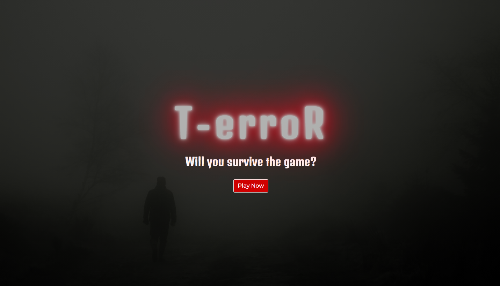
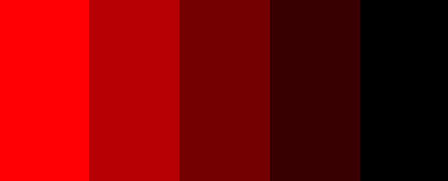
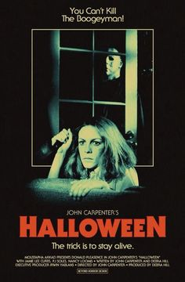

# T-erroR #
---

## Contents ##
---

* UX
    * [Project Goals](#project-goals)
    * [User Goals](#user-goals)
    * [User Stories](#user-stories)
    * [Site Owner Goals](#site-owner-goals)
    * [User Requirements and Expectations](#requirements)
    * [Design Choices](#design-choices)
        * [Fonts](#fonts)
        * [Icons](#icons)
        * [Colors](#colors)
* [Wireframing](#wireframing)
* [Features](#features)
    * [Features that have been developed](#developed)
    * [Features that will be implemented in the future](#implemented)
* [Technologies](#technologies)
* [Testing](#testing)
* [Issues](#issues)
* [Deployment](#deployment)
* [Credit](#credits)

## UX (User Experience) ##
---

### Project Goals ###

The **goal** for this project is to create an **horror-oriented timed quizz** called **T-erroR** that question the user about their knowledge of horror movies and gives a survival score at the end.

### User Goals ###

* **Testing his/her/their knowledge** on **Horror movies** within **15sec** per question.
* **Being entertained** by the game.
* **Playing** all the **cards**.
* **Score high** on all cards.
* Get a **final score for survival**.
* **Play** the game **again**.

### User Stories ### 

* The **user** wants an **attractive game**.
* The **user** wants **clear instructions**
* The **user** wants to be **challenged** in his/her/their **knowledge** of **horror movies**.
* The **user** wants to have **diversity** in question difficulty.
* The **user** wants to get a maximum of points.
* The **user** wants to **survive** the game.

### Site Owner Goals ###

All **site owner** goals have to be read aloud as a **Baseline Test** from **Blade Runner**

*

### User Requirements and Expectations ###

### Requirements ###

* 

**Expectations**

*

### Design Choices ###
---
* When developing this **game**, I kept in mind that the aesthetic should be inspired by Horror Movies. I tried to create a moody and slightly unnerving ambiance for the landing page and a cleaner, colder approach for the card page.
* I found a [**Youtube quizz tutorial**](https://www.youtube.com/watch?v=pQr4O1OITJo) that I first **coded along** in this [**repository**](https://github.com/AudreyLL88/quizz) and adapted to my needs.

### Fonts ###

* The **landing page** is using the  horror classic **Google Fonts** **Denk One** for the H1 and H3. That font is associated with a [**Neon effect**](https://codepen.io/AllThingsSmitty/pen/VzXrgY) and a [**slow Pulse effect**](https://tilomitra.github.io/infinite/) on the H1.
I chose the pulsing effect because of its association with a heartbeat, which is a sound often associated with horror and fear. I paired it with the **Google Fonts** **Montserrat** for readability.
* The **card page** is using **Denk One** again for the **H3 page title** paired with **Montserrat** on the **instructions** in the **header** as well as on the **cards**.
* I kept the **Montserrat** font for **better user experience** in the **quizz** and **avoid confusion**.

### Icons and Images ###

* **All icons** used on the website are provided by [**FontAwesome**](https://fontawesome.com/) on the **card result** and **final result boxes**.
* The **image** used for the **landing page** is a **free image** from the image bank [**Pixabay**](https://pixabay.com/sv/) with a simple research with the keyword **spooky**.
* **All cards images** have been custom made by **Ivar Dahlberg** (aka my husband) for this **game**.

### Colors ###

* The **color scheme** used for the website is a classic **slasher poster palette** composed of a combination of **dark and light reds** for the **title** as well the **buttons** on the **cards** and the **quizz** paired with an **off-black** and **pure white**.
* The **gradients** used for the **body** and the **Quizz background** can both be found on [**Ui Gradients**](https://uigradients.com/) under the names **Frozen** and **Anwar**.

 

## Wireframing ##
---
For **wireframing** I used the tool [**Balsamiq**](https://balsamiq.com/).

View my wireframes [here](img/t-error.pdf).

* As you can see this is **a minimal wireframe** and I pushed a few changes for better readability and engagement:
* I added **a full-screen hero image** on the landing page.
* I added a **full-screen background** behind the quizz box rather than letting the cards visible in the background.

## Features ## 
---

### Implemented Features ###

* **Responsiveness** on all screen sizes.
* **Pulsing neon title** for attractiveness and engagement.
* **Cards flipped on hover** as an introduction to the theme and choice management for the user. One card cannot be played multiple times.
* **Instruction box** displayed on click on the same page as the card game .
* **Multiple choice quizz box with timer** taking information from an array depending on which card is played .
* **Card Score** at the end of each card played.
* **Final Score** based on each card score when all cards are played.

### Future implemented features ###

* Image hint.
* Ratings on the game.

## Technologies used ##

* [HTML](https://developer.mozilla.org/en-US/docs/Web/HTML)
* [CSS](https://developer.mozilla.org/en-US/docs/Web/CSS)
* [Javascript]()
* [JQuery](https://jquery.com/)

**Tools & Libraries**

* [Bootstrap](https://getbootstrap.com/)
* [Font-Awesome](https://fontawesome.com/icons?d=gallery)
* [Google fonts](https://fonts.google.com/)
* [Git](https://git-scm.com/)

## Testing ##
---

* I tested the responsiveness of the website by using the [**Google Chrome DeveloperTool**](https://developers.google.com/web/tools/chrome-devtools) as well as the plug-in **Unicorn Revealer** to control my overflow and the website [**Am I Responsive**](http://ami.responsivedesign.is/). 
* I also tested my website on **different browsers and real devices** : **Iphone 6s, Iphone X, Ipad Pro 12", Macbook air and Samsung Galaxy S20.**
* I used a first **dirty version** of this project on **Gitpod** and **refactored** my code **step by step** to remove any **useless classes**
* I tested my CSS file and my HTML files using [**CSS Validator**](https://jigsaw.w3.org/css-validator/) and [**HTML Validator**](https://validator.w3.org/).
* All pages passed the HTML and CSS validator final test.

**Responsiveness**

* **Implementation** 

* I used the **Bootstrap** as well as **flexbox and custom CSS media queries** to ensure that the website didn't break on all screen sizes.
* To ensure that the **hover** class would work on IOS, I used the poetic attribute **ontouchmove** in the html tag of card.html.

**Cards**

* **Implementation** 

**Neon Pulsing Title**

* **Implementation** 

**Quizz with timer**

* **Implementation**

**Card Score**

* **Implementation**

**Final Score**

* **Implementation**

## Issues ##
---

**During development**

* I had a major issue with my script.js file after everything was done because of this issue:

I did not understand what was going on but it stopped my javascript from working and couldn't get help so I created a second script file and copy/pasted step by step code from the first "dirty" repository I worked on. I then deleted the damaged script file, but it also deleted all my commits on that file...
You can find the code from **the first "dirty" repository here : https://github.com/AudreyLL88/terror_v1.git**

## Deployment ##
---
**T-erroR** was developed on **GitPod**, using **GitHub** to host the repository and deployed on **GitHub Pages**.
**GitHub** made the deployment extremely painless:

* Connected to Github
* Selected the repository **AudreyLL88/terror_project**
* Clicked on **"settings"** in the navigation bar
* In the **GitHub Pages** I selected **Master Branch** and **/root** in the dropdown menu and clicked **Save**
* I waited 2 minutes.
* And voila! **The website is now live on**

**Cloning ?** No problem:

* In my repository **AudreyLL88/terror_project**, click on the **"Code** green button, **copy in clipboard the HTTPS link**, open your **browser** and look through my files.
* The link : **https://github.com/AudreyLL88/terror_project.git**

## Credits ##
---

**Text Credits:**

* All text content has been written by yours truly, Audrey Laurène Lloancy.

**Many thanks to:**

* My mentor **Ignatius Ukwuoma** for his patience and kindness
* **Byllsa** for her very inspiring ReadME
* **Code Institute Slack community** for the technical and emotional support
* **Ivar Dahlberg**, for all the beautiful designs he created and his assistance
* **Mesaicos Stockholm LandHockey team** for cutting me some slack for not being very alert (and I am the goalkeeper...)

**Site for educational purposes only!** (for now)
